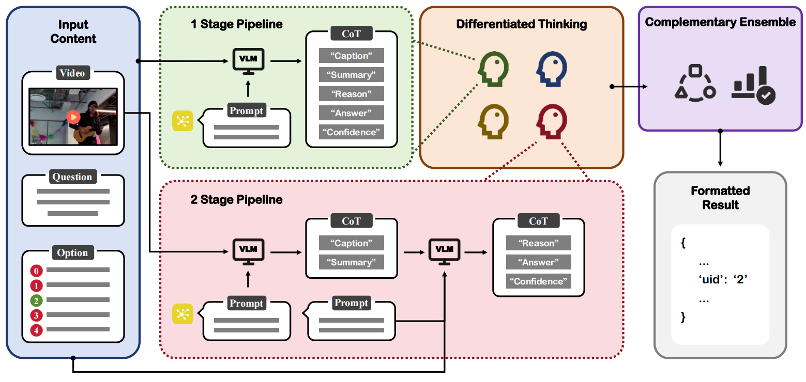

<p align="center" >
<a></a>
</p>

---


<h5 align="left"> If our project helps you, please give us a star ⭐ on GitHub to support us. 🙏🙏 </h2>

  <a src="https://img.shields.io/badge/cs.CV-2405.03959-b31b1b?logo=arxiv&logoColor=red" href="https://arxiv.org/abs/2505.16784" height="25">   
</a> 

### 💬 This repo is the official implementation of:
- ***EgoSchema @ CVPR 2025***: [Four Eyes Are Better Than Two: Harnessing the Collaborative Potential of Large Models via Differentiated Thinking and Complementary Ensembles](https://arxiv.org/abs/2505.16784) 

Jun Xie*, [Xiongjun Guan](https://xiongjunguan.github.io/)*  (student first author), Yingjian Zhu, Zhaoran Zhao, Xinming Wang, Hongzhu Yi,  Feng Chen,  Zhepeng Wang

---

## :art: Introduction

In this paper, we present the <strong><font color="red">runner-up</font></strong> solution for the [Ego4D EgoSchema Challenge](https://github.com/egoschema/EgoSchema) at CVPR 2025 (Confirmed on May 20, 2025).

Inspired by the success of large models, we evaluate and leverage `leading accessible multimodal large models` and adapt them to video understanding tasks via `few-shot learning` and `model ensemble` strategies. 

The overview of our solution is shown as follows.
<p align="center">
     <br />
</p>

For a given set of input content, which includes a specific video along with corresponding question and options, we construct various prompts, data streams, and Chain of Thoughts (CoT). These are then fed into Video-Language Models (VLMs) to generate several responses with multiple focal points. Next, the most complementary CoT results are summarized and ensembled to determine the final answer, which is then presented in a structured and formatted manner.

<br>

## :wrench: Requirements

```text
json_repair==0.46.2
matplotlib==3.10.3
moviepy==2.2.1
numpy==2.3.0
protobuf==4.25.3
tqdm==4.66.5
google-genai==1.12.1
```

<br>

## :exclamation: Notice

The code will be gradually released after it has been properly organized.

<br>

## :rocket: Inference

:point_up:  First, you need to organize the file structure as follows:
```
|-video_dir # videos
    |- 1.mp4 
    |- 2.mp4 ...

|-questions
    |-questions.json # question and options

```

:point_up: Next, adjust the prompt words and examples according to your needs and check the output requirements.

You need to modify the file path `--videos_dir`, `--questions_file`, and fill in the corresponding API key `api_keys` (we have alternately used multiple sets of keys to overcome the limitation of usage rate).

- Execute 1-stage pipeline:
```bash
python inference-1stage.py
```

- Execute 2-stage pipeline:
```bash
python inference-2stage-1.py
python inference-2stage-2.py
```

:point_up: Then, organize the thinking results into the form of competition requirements.
Please note that the original thinking results `result_dir` and target path `output_path` need to be modified to adapt.
```bash
python get_answers.py
```

:point_up: Finally, the diverse results from experts with different ways of thinking are integrated to reach a final judgment.

You need to fill in the path of diversified thinking results in `expert_path_lst` obtained in the above phase, as well as the corresponding accuracy rate `expert_acc`.
```bash
python model_ensemble.py
```


<br>

## :bookmark_tabs: Citation

If you find this repository useful, please give us stars and use the following BibTeX entry for citation.

```
@misc{egoschema2025rank2,
      title={Four Eyes Are Better Than Two: Harnessing the Collaborative Potential of Large Models via Differentiated Thinking and Complementary Ensembles},
      author={Jun Xie, Xiongjun Guan, Yingjian Zhu, Zhaoran Zhao, Xinming Wang, Hongzhu Yi, Feng Chen, Zhepeng Wang},
      year={2025},
      eprint={2505.16784},
      archivePrefix={arXiv},
      primaryClass={cs.CV},
      url={https://arxiv.org/abs/2505.16784},
}
```

<br>

## :triangular_flag_on_post: License

This project is released under the Apache license. Please see the LICENSE file for more information.


<br>

---

## :mailbox: Contact Me

If you have any questions about the code, please contact Xiongjun Guan
gxj21@mails.tsinghua.edu.cn


